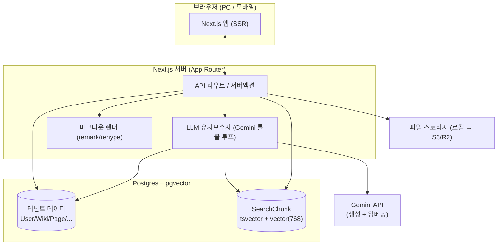

# jimi-wiki 플랫폼 — 설계 문서 (v0.1)

작성: 2026-07-02 · 갱신: 2026-07-03 · 상태: **Phase 1 구현 진행 중** (별도 코드베이스, 이 저장소 아님)

이 문서는 현재의 단일 사용자 로컬 위키(Quartz + Claude Code)를 **멀티테넌트 위키 플랫폼(SaaS)** 으로 발전시키기 위한 설계다. 스택은 **Next.js + Postgres/pgvector**로 확정. 지금은 클라우드 배포를 하지 않고 **로컬에서 제품 아키텍처로 MVP**를 만든 뒤, 동일 구조를 나중에 배포한다.

> 관련: 현재 로컬 위키의 원리는 [Karpathy LLM Wiki 패턴](https://gist.github.com/karpathy/442a6bf555914893e9891c11519de94f)과 저장소 `CLAUDE.md` 참조. 이 문서는 그 패턴을 멀티유저 제품으로 옮긴다.

---

## 1. 목표와 비목표

### 목표
- 한 유저가 **여러 개의 위키**를 소유(개인용, 프로젝트용 등).
- 위키는 유저에 단단히 묶이지 않는다 — **공유 위키**(여러 멤버가 함께 편집), **공개 공유**(읽기 링크), **위키 채널**(공개적으로 둘러보는 위키)이 가능.
- 각 위키 안에서 **LLM 유지보수자**(ingest/query/lint)가 서버측에서 동작 — 현재 로컬 워크플로우를 그대로 제품화.
- 각 위키별 **하이브리드 검색**(BM25 + 임베딩).

### MVP 비목표 (나중 단계로 연기)
- 실시간 공동 편집(CRDT)
- 결제/요금제
- 채널 팔로우·피드 같은 소셜 기능
- 그래프 뷰(초기엔 백링크만)
- 클라우드 배포(로컬 우선)

---

## 2. 핵심 개념 (도메인 모델)

| 개념 | 설명 |
|---|---|
| **User** | 계정. 인증 주체 |
| **Wiki** | 지식 기반 하나(=워크스페이스). 유저는 여러 개 소유. `visibility`로 공개/비공개 결정 |
| **Membership** | User↔Wiki 다대다 + 역할(owner/editor/viewer). "유저에 안 묶임"의 핵심 — 위키 접근은 단일 FK가 아니라 멤버십으로 |
| **ShareLink** | 계정 없이 읽을 수 있는 공개 링크(토큰, 만료) |
| **Page** | 위키 안의 마크다운 문서. `kind`(note/concept/entity/answer/meta), frontmatter, body |
| **PageLink** | 페이지 간 위키링크(파생) — 백링크·그래프용 |
| **Source** | 원문(불변). ingest의 입력 |
| **SearchChunk** | 페이지·원문을 청크로 쪼갠 검색 단위(tsvector + embedding) |
| **LogEntry** | 위키별 작업 로그(ingest/query/lint) — 현재 `log.md`의 DB판 |
| **AgentRun** | 서버측 LLM 작업 실행 기록(비동기 잡) |
| **Channel** | (Phase 2) 공개적으로 둘러보는 위키. MVP에서는 `visibility=public`인 Wiki로 대체 |

### 멀티테넌시·공유 모델
- 모든 콘텐츠 행(Page/Source/Chunk/Log)은 **`wikiId`를 가진다.** 모든 쿼리는 `wikiId` + 멤버십 검사로 격리.
- 위키 `visibility`: `private`(멤버만) / `unlisted`(링크 아는 사람) / `public`(채널로 노출).
- 역할: `owner`(삭제·멤버관리) > `editor`(ingest·편집) > `viewer`(읽기).
- "내 위키를 공유해서 보여주기" = ShareLink(viewer) 또는 상대를 viewer 멤버로 추가.

---

## 3. 아키텍처



- **Next.js (App Router)**: 앱 + API + SSR 렌더를 한 코드베이스에. 비공개 위키는 인증 뒤 SSR, 공개 위키/채널은 공개 라우트(후에 정적 export 가능).
- **Postgres + pgvector**: 테넌트 데이터와 벡터 검색을 하나의 DB로. 풀텍스트는 `tsvector`(GIN), 벡터는 `vector(768)`(HNSW).
- **Gemini**: 생성(ingest/query/lint 에이전트)과 임베딩(`gemini-embedding-001`) 모두. 기존 로컬 키 재사용.
- **스토리지**: 원문·이미지 파일은 MVP에서 로컬 디스크 → 후에 S3/R2.
- **ORM**: Prisma (마이그레이션·타입 안전).
- **인증**: Auth.js(NextAuth) — MVP는 GitHub OAuth 또는 이메일 매직링크 하나.

---

## 4. 데이터 모델 (초안)

```
User(id, email, name, image, createdAt)

Wiki(id, slug, title, description, visibility['private'|'unlisted'|'public'],
     kind['personal'|'project'|'channel'], createdBy→User, createdAt, updatedAt)

Membership(id, wikiId→Wiki, userId→User, role['owner'|'editor'|'viewer'], createdAt)
     UNIQUE(wikiId, userId)

ShareLink(id, wikiId→Wiki, token, role['viewer'], expiresAt, createdAt)

Page(id, wikiId→Wiki, slug, title, kind, frontmatter[jsonb], body[text],
     createdAt, updatedAt)   UNIQUE(wikiId, slug)

PageLink(id, wikiId, fromPageId→Page, toSlug, toPageId→Page?nullable)
     -- 저장 시 재계산. toPageId null이면 깨진 링크(lint 대상)

Source(id, wikiId→Wiki, slug, title, url, storageKey|body[text],
     ingestedAt)   -- 불변

SearchChunk(id, wikiId, refType['page'|'source'], refId, heading, text,
     tsv[tsvector], embedding[vector(768)], hash)
     INDEX gin(tsv), INDEX hnsw(embedding vector_cosine_ops), INDEX(wikiId)

LogEntry(id, wikiId→Wiki, kind['ingest'|'query'|'lint'], title, detail, createdAt)

AgentRun(id, wikiId, userId, type['ingest'|'query'|'lint'], status, input[jsonb],
     output[jsonb], error, createdAt, finishedAt)
```

모든 접근 경로: **요청 → 세션의 userId → 대상 wikiId에 대한 Membership/공개여부 확인 → wikiId로 필터된 쿼리.**

---

## 5. LLM 유지보수자 (서버측 에이전트)

현재 `CLAUDE.md`의 ingest/query/lint 규칙이 **에이전트 시스템 프롬프트**로 이식된다. Claude Code CLI 대신 **서버측 Gemini 툴콜 루프**가 위키의 DB 콘텐츠를 대상으로 실행.

**에이전트에게 주는 툴**(전부 `wikiId` 스코프):
- `listPages()` / `readPage(slug)` / `writePage(slug, frontmatter, body)` / `deletePage(slug)`
- `searchWiki(query)` — 하이브리드 검색(§6)
- `readSource(id)` / `appendLog(kind, title, detail)`

**Ingest 흐름** (`POST /api/wikis/:id/ingest`, 비동기 AgentRun):
1. 입력(URL/텍스트/파일) → 원문 fetch → `Source` 저장(불변).
2. Gemini 에이전트 루프: 원문 읽기 → 소스 노트 작성(`writePage`) → 관련 개념/개체 페이지 갱신 → 모순 플래그 → `appendLog`.
3. 완료 후 변경된 페이지의 `SearchChunk` 재생성 + 임베딩(증분, hash 기준).
4. `PageLink` 재계산.

**Query**: 하이브리드 검색으로 후보 페이지 회수 → 에이전트가 종합·인용 → (가치 있으면) `answer` kind 페이지로 저장.
**Lint**: 에이전트가 위키를 훑어 모순·고아·깨진 링크·누락 개념 보고(+자동 수정 옵션).

> MVP는 ingest를 인라인 스트리밍으로 실행해도 됨. 부하가 커지면 잡 큐(예: pg 기반 큐)로 전환.

---

## 6. 하이브리드 검색 (Postgres 재구현)

현재 `scripts/wikisearch.mjs`(SQLite FTS5 + Gemini 임베딩 + RRF) 로직을 **Postgres로 이식**. 위키별 격리가 핵심.

- **BM25/풀텍스트**: `SearchChunk.tsv`(GIN). MVP는 Postgres FTS(`websearch_to_tsquery` + `ts_rank`). 진짜 BM25가 필요하면 후에 ParadeDB `pg_search`로 업그레이드.
- **시맨틱**: `embedding vector(768)`(pgvector, HNSW, 코사인). 쿼리 임베딩은 Gemini `RETRIEVAL_QUERY`.
- **융합**: 각 랭킹 상위 N개를 앱(또는 SQL CTE)에서 **RRF**로 결합.
- 모든 검색은 `WHERE wikiId = ?`로 테넌트 격리.

인덱싱은 페이지 저장/ingest 시 훅으로 갱신 → 현재의 수동 `index` 명령이 **자동 트리거**로 바뀐다(앞서 나온 "인덱싱 자동화" 요구 해결).

---

## 7. 렌더링

- 페이지 `body`(마크다운)를 remark/rehype로 렌더(Quartz도 동일 기반). 위키링크 `[[slug]]`는 **해당 위키 스코프**로 해석.
- **백링크**: `PageLink`에서 `toPageId = 현재페이지` 조회.
- **그래프 뷰**: `PageLink`로 그래프 구성(Phase 3, 클라이언트 라이브러리).
- 비공개 위키: 인증 뒤 SSR. 공개 위키/채널: 공개 라우트(후에 정적 캐시).

---

## 8. API 표면 (초안)

```
Auth:            Auth.js 라우트
Wikis:           POST /api/wikis            (생성)
                 GET  /api/wikis            (내 위키 목록)
                 GET  /api/wikis/:id        (메타 + 페이지 인덱스)
Members/Share:   POST /api/wikis/:id/members
                 POST /api/wikis/:id/share-links
Pages:           GET/POST/PATCH/DELETE /api/wikis/:id/pages[/:slug]
Search:          GET  /api/wikis/:id/search?q=
Agent:           POST /api/wikis/:id/ingest
                 POST /api/wikis/:id/query
                 POST /api/wikis/:id/lint
```

---

## 9. 단계적 로드맵

### Phase 0 — 설계 (지금)
이 문서 확정. 데이터 모델·에이전트 툴 계약 합의.

### Phase 1 — MVP (로컬)
목표: **"혼자 여러 위키를 쓰는" 경험 완성.**
- 인증(1개 provider)
- 위키 생성/목록 (개인·프로젝트) — 한 유저가 여러 개
- 페이지 목록·조회·수동 편집 + 위키링크/백링크 렌더
- **위키별 ingest 에이전트(Gemini)** — 제품의 핵심 마법
- **위키별 하이브리드 검색**(pg + pgvector, 자동 인덱싱)
- 위키는 단일 owner(멤버십 테이블은 만들되 공유 UI는 다음 단계)

수용 기준: 로그인 → 위키 2개 생성(개인/프로젝트) → 각각에 URL ingest → 페이지·백링크 확인 → 검색 동작.

### Phase 2 — 협업·공유
멤버십 UI, ShareLink(공개 읽기), `visibility=public` 위키 + 채널 디스커버리(둘러보기).

### Phase 3 — 폴리시·배포
그래프 뷰, (선택)실시간, 클라우드 배포, 이미지 스토리지(S3/R2), (선택)결제.

---

## 10. 현재 저장소에서 이어지는 것

| 현재(로컬) | 제품 |
|---|---|
| `CLAUDE.md` 스키마 | 에이전트 시스템 프롬프트로 이식 |
| `scripts/wikisearch.mjs` | Postgres+pgvector로 로직 재구현 |
| `content/`의 kind 구조·index·log | Page.kind / Wiki 인덱스 / LogEntry 테이블 |
| 마크다운 콘텐츠 | Page.body(text)로 import(가장 쉬운 이관 경로) |
| Quartz | (선택) 공개 위키의 정적 퍼블리싱에만 잔류 |

현재 로컬 위키는 **그대로 유지**(레퍼런스 겸 개인 위키). 제품은 새 코드베이스로 시작.

---

## 11. 열린 질문 (Phase 1 착수 전 확정 권장)

1. **인증 provider**: GitHub OAuth vs 이메일 매직링크 — 뭘 먼저?
2. **콘텐츠 원천**: DB text(권장) vs 위키별 git 백업. MVP는 DB.
3. **채널 의미**: 단순 공개 위키 노출 vs 팔로우/피드까지 — 어디까지?
4. **에이전트 실행**: 인라인 스트리밍(MVP) vs 잡 큐 — MVP는 인라인으로 시작.
5. **제품 코드 위치**: ~~이 저장소 안 하위 폴더 vs 별도 신규 저장소~~ → **별도 코드베이스로 확정** (구현 진행 중). 이 저장소는 로컬 위키 + 설계 문서 보관.
6. **BM25 수준**: Postgres FTS로 시작(권장) vs 초기부터 ParadeDB.

---

## 12. 구현 진행 상태 (2026-07-03 기준)

Phase 1 MVP가 별도 코드베이스에서 상당 부분 동작 중. 스크린샷: [`assets/shell-wikis.png`](assets/shell-wikis.png), AI 질문 화면 스냅샷: [`assets/chat-ui-a11y-snapshot.md`](assets/chat-ui-a11y-snapshot.md).

확인된 동작:
- 위키 목록·생성 (personal/project kind, 공개 여부 표시) — 위키 3개 운영 중
- 채널 둘러보기, API 키 관리, 로그인/로그아웃
- AI 질문(Query): 위키 지식 기반 답변 + 번호 인용 링크 + "위키에 저장" 버튼

## 13. UX 피드백 (2026-07-03) — ✅ 구현 완료 (2026-07-04)

아래 두 항목 모두 앱 코드베이스에 구현·검증됨. 모달은 플로팅 챗봇 버튼(FAB) + `Ctrl+K`/`⌘K`/`/` 단축키로 진입하고, 근거 문서 모달에서 관련 문서 이어보기까지 지원한다. 함께 들어간 것: 근거 패널 인용/미인용 분리 + 건별 관련도 컷오프, lint 원문 중복 감지·provenance 오탐 수정, ingest 소스 노트 복붙 금지 프롬프트, ingest 모델 gemini-3.1-pro 상향, 전역 잡 인디케이터(실행 중 pill + 작업 이력 패널), 새 페이지 전용 화면, ingest 진행 배지. dev 환경: `allowedDevOrigins`(oss-wsl) + 포트 3007 고정.

원래 요구사항 (기록용):

1. **AI 질문을 모달/오버레이로**: 현재는 별도 페이지(`AI에게 질문`)로 이동하는 구조인데, 페이지 이동 없이 **어느 화면에서든 모달로 띄워** 쓰는 편이 사용성이 좋다.
   - 읽던 페이지의 컨텍스트(스크롤 위치, 현재 문서)를 잃지 않는다.
   - 커맨드 팔레트 스타일(예: `Cmd+K`) 호출을 고려. 검색과 AI 질문을 한 진입점으로 통합하는 방향도 검토.
   - 모달 안에서 인용 링크 클릭 시: 모달을 닫고 이동하거나, 모달 내 미리보기로 보여주는 방식 중 선택 필요.
   - "위키에 저장"은 모달에서도 동일하게 동작해야 한다.
2. **관련 문서 탐색 기능**: 페이지를 읽다가 연결된 문서들을 둘러볼 수 있어야 한다.
   - 페이지 사이드바(또는 하단)에 **백링크 + 아웃링크를 함께 보여주는 "관련 문서" 패널**.
   - 그래프 뷰(Phase 3)의 경량 선행 기능 — `PageLink` 테이블로 이미 데이터는 있음 (§4, §7).
   - AI 답변 모달의 인용 문서에서도 "이 문서의 관련 문서"로 이어지는 탐색 흐름을 고려.
